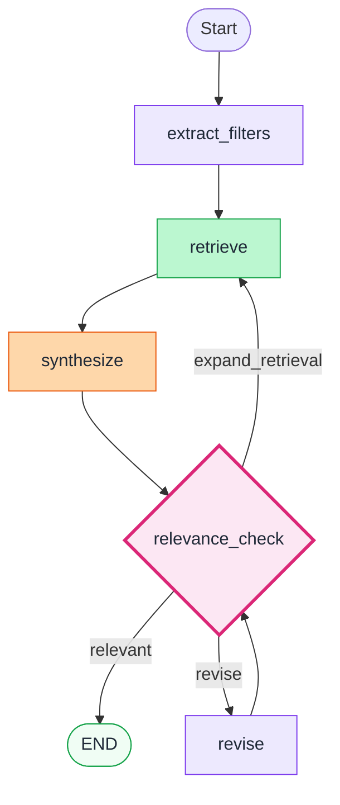

<div align="center">

# 🏛️ Bundestags-RAG-Chatbot

**Ein agentic RAG-System mit Self-Reflection-Loop für Bundestags-Plenarprotokolle**

[](https://www.python.org/)
[](https://langchain-ai.github.io/langgraph/)
[](https://www.langchain.com/)
[](https://mistral.ai/)
[](https://ollama.com/)
[](https://www.trychroma.com/)
[](https://www.gradio.app/)

</div>

---

## 📋 Über das Projekt

Ein RAG-basierter Chatbot, der Fragen zu Plenarprotokollen des Deutschen Bundestags beantwortet. Das System nutzt einen **LangGraph-Workflow mit iterativem Self-Reflection-Loop**, der die generierte Antwort selbst evaluiert und bei Bedarf entweder erneut retrievet oder die Antwort überarbeitet.

Das Besondere an diesem Projekt ist nicht der RAG-Teil an sich, sondern die **bewusste Architektur-Entscheidung für ein agentic Pattern mit zwei differenzierten Recovery-Pfaden**. Ein klassisches lineares RAG-System hätte für diese Aufgabe ausgereicht, aber bei Recherche-Fragen zu spezifischen Sprechern oder Themen ist es wertvoll, dass der Agent eigenständig erkennen kann, ob die Evidence-Basis oder die Antwort selbst das Problem ist.

### Beispiel-Fragen

```
"Was hat Michael Thews zur Energiesteuer gesagt?"
"Welche Argumente brachte die AfD gegen das 9-Euro-Ticket?"
"Was wurde in Tagesordnungspunkt 4 zum Gasnetz diskutiert?"
"Welche Positionen hat Die Linke zur Energiepolitik vertreten?"
```

---

## 🏗️ Architektur

```
┌─────────────────────────────────────────────────────────────────┐
│                     INDEXING (offline)                          │
│                                                                 │
│   XML Protokolle  →  Parser & Chunker  →  bge-m3  →  Chroma     │
│   (dip.bundestag.de)  (1 Chunk = 1 Rede)  (Ollama)  (persistent)│
└─────────────────────────────────────────────────────────────────┘
                              ↓ queries
┌─────────────────────────────────────────────────────────────────┐
│                          RUNTIME                                │
│                                                                 │
│   User  →  Gradio UI  →  LangGraph Agent  ←→  Mistral Small 4   │
│                            (mit Self-                           │
│                             Reflection)                         │
└─────────────────────────────────────────────────────────────────┘
```

### Schlüsselentscheidungen

**LLM via API, Embeddings lokal.** Eine bewusste Aufteilung. Embeddings über `bge-m3` rechnen lokal über Ollama auf der CPU, das LLM für Generation läuft über die Mistral-API. Vorteil ist eine pragmatische Mischung aus Datenschutz für die Dokumenten-Embeddings und Performance/Skalierung für die Generation.

**LangGraph statt LangChain Chains.** Der Workflow enthält eine Conditional Edge zwischen Relevance-Check und Refinement-Loop. Mit LangChain alleine müsste diese Logik manuell mit Schleifen aufgebaut werden. LangGraph macht den Kontrollfluss explizit und gut sichtbar.

**XML statt PDF.** Plenarprotokolle gibt es auf dip.bundestag.de in beiden Formaten. XML hat hier den Vorteil, dass Sprecher, Fraktion und Tagesordnungspunkte über semantische Tags eindeutig zugeordnet sind. Bei PDF-Parsing wäre Regex-basierte Heuristik nötig, die in Production schnell fragil wird.

**Chunking pro Redebeitrag.** Da der Sprecher als harter Filter wirken muss, ist die Chunk-Granularität direkt an die Redebeitrags-Grenze gekoppelt. Bei sehr langen Reden (z. B. Regierungserklärungen) wird mit Overlap an Absatzgrenzen weiter gesplittet, ohne dass die Metadaten verloren gehen.

---

## 🔄 LangGraph Workflow

Der zentrale Workflow folgt einem **Self-Reflection-Pattern**: erst antworten, dann auf die Antwort prüfen, und nur bei festgestellter Schwäche einen von zwei Recovery-Pfaden einschlagen.



### Die Nodes

| Node | Aufgabe |
|------|---------|
| `extract_filters` | Extrahiert strukturierte Filter (Sprecher, Fraktion, Sitzung, TOP) per Pydantic-Schema mit `with_structured_output` |
| `retrieve` | Vector-Suche in Chroma mit Metadaten-Filter, bei Iteration > 0 mit erweitertem k |
| `synthesize` | Generiert die Antwort mit Quellen-Annotation `[1]`, `[2]` etc. |
| `relevance_check` | Bewertet die Antwort auf Relevanz und entscheidet über den nächsten Schritt |
| `revise` | Überarbeitet die Antwort, wenn die Synthese das Problem war (nicht das Retrieval) |

### Conditional Routing

Nach dem `relevance_check` entscheidet die Conditional Edge anhand zweier Signale.

**`expand_retrieval`** signalisiert, dass der Antwort schlicht Evidence fehlt. Der Agent geht zurück zum Retrieval und holt mit erhöhtem k mehr Dokumente.

**`revise`** signalisiert, dass die Daten ausreichend sind, aber die Formulierung der Antwort unklar oder unvollständig war. In diesem Fall wird nur die Synthese mit Kontext zur Schwäche überarbeitet, ohne neues Retrieval.

Der Loop terminiert nach maximal zwei Iterationen, um Endlos-Schleifen auszuschließen.

---

## 🛠️ Tech-Stack

| Schicht | Technologie | Begründung |
|---------|-------------|------------|
| **Orchestrierung** | LangGraph | Conditional Edges, State Management |
| **LLM (Generation)** | Mistral Small 4 (API) | Günstig, großes Kontextfenster, structured output |
| **LLM (Extraktion)** | Mistral Small 4 (temp 0) | Deterministisch für Filter-Extraktion |
| **Embeddings** | bge-m3 (Ollama) | Multilingual, lokal, gut auf längeren Texten |
| **Vector Store** | Chroma | Persistent, einfache Metadaten-Filter |
| **UI** | Gradio | Schneller Prototyping-Stack mit Chat-Komponente |
| **Observability** | LangSmith | Tracing, Token-Kosten, Debugging |
| **Schema-Validierung** | Pydantic | Structured outputs, Settings-Management |

---

## 🚀 Quickstart

### Voraussetzungen

- Python 3.11 oder höher
- [Ollama](https://ollama.com/) lokal installiert (für Embeddings)
- Mistral API Key ([api.mistral.ai](https://api.mistral.ai/))

### Installation

```bash
# Repository klonen
git clone https://github.com/<username>/agentic-rag-demo.git
cd agentic-rag-demo

# Virtuelle Umgebung
python -m venv venv
source venv/bin/activate  # auf Windows: venv\Scripts\activate

# Dependencies installieren
pip install -r requirements.txt

# Embedding-Modell laden
ollama pull bge-m3
```

### Konfiguration

`.env`-Datei im Projekt-Root anlegen.

```bash
MISTRAL_API_KEY=your_mistral_api_key_here

# Optional, mit sinnvollen Defaults
MISTRAL_MODEL=mistral-small-latest
OLLAMA_BASE_URL=http://localhost:11434
EMBEDDING_MODEL=bge-m3:latest
CHROMA_DIR=./chroma_db
CHROMA_COLLECTION=bundestag
```

### Daten vorbereiten

XML-Plenarprotokolle von [dip.bundestag.de](https://dip.bundestag.de/) herunterladen und in `./data/` ablegen.

```bash
mkdir -p data
# XML-Dateien in ./data/ kopieren
```

### Indexing

```bash
python scripts/index.py
```

Das Skript parst alle XML-Dateien im `./data/`-Verzeichnis, splittet die Redebeiträge in Chunks und erzeugt die Chroma-Collection.

### App starten

```bash
python app.py
```

Die Gradio-UI ist unter `http://localhost:7860` erreichbar.

---

## 📁 Projektstruktur

```
agentic-rag-demo/
├── app.py                          # Einstiegspunkt
├── scripts/
│   ├── index.py                    # Daten-Indexing
│   └── inspect_db.py               # Chroma-Collection inspizieren
├── src/
│   ├── config.py                   # Pydantic Settings
│   ├── workflow.py                 # LangGraph-Definition
│   ├── llm/
│   │   └── providers.py            # LLM-Factory
│   ├── nodes/                      # LangGraph Nodes
│   │   ├── extract_filters.py
│   │   ├── retrieve.py
│   │   ├── synthesize.py
│   │   ├── relevance_check.py
│   │   └── revise.py
│   ├── prompts/                    # Alle Prompts zentralisiert
│   │   ├── extraction_prompt.py
│   │   ├── synthesize_prompt.py
│   │   ├── relevance_check_prompt.py
│   │   └── revision_prompt.py
│   ├── retrieval/
│   │   ├── vector_store.py         # Chroma + Ollama Setup
│   │   └── filter_builder.py       # Chroma-Filter aus Pydantic
│   ├── preprocessing/
│   │   ├── parser.py               # XML-Parser
│   │   └── indexer.py              # Chunking + Embedding
│   ├── schemas/                    # Pydantic Models
│   │   ├── query_filters.py
│   │   └── relevance_check.py
│   └── state/
│       └── agent_state.py          # LangGraph State
├── ui/
│   └── ui.py                       # Gradio Interface
├── data/                           # XML-Rohdaten (gitignored)
├── chroma_db/                      # Vector Store (gitignored)
└── requirements.txt
```

Die Trennung von **Nodes** (atomare Schritte) und **Workflow** (Graph-Definition) ist bewusst gewählt, damit jede Node isoliert testbar bleibt und der Graph als reine Composition-Datei lesbar ist.

---

## 🎯 Was das System aus den Metadaten beantworten kann

Die Wahl der indexierten Metadaten bestimmt direkt, was über strukturierte Filter beantwortbar wird.

| Frage-Typ | Genutzte Filter |
|-----------|-----------------|
| „Was hat Sprecher X gesagt?" | `speaker_lastname`, `speaker_firstname` |
| „Was sagte die Fraktion Y?" | `fraktion` (mit Normalisierung) |
| „Was wurde in Sitzung 75 diskutiert?" | `session_number` |
| „Was kam in TOP 6 vor?" | `top_nr` (mit Format-Normalisierung) |
| Themenfragen ohne Filter | rein semantisch |
| Kombinierte Anfragen | beliebige Filter-Kombination |

### Filter-Normalisierung

Da Bundestags-XML uneinheitliche Bezeichnungen verwendet, normalisiert der `filter_builder` Fraktionen und Tagesordnungs-Bezeichner auf die im Index gespeicherten Werte. Beispielsweise werden `"Grüne"`, `"GRÜNE"`, `"Die Grünen"` alle zu `BÜNDNIS 90/DIE GRÜNEN`, und `"TOP 6"` wird zu `Tagesordnungspunkt 6`.

---

## 🧠 Bewusst nicht implementiert

Diese Punkte sind aus Scope herausgenommen worden, um ein sauberes End-to-End-System statt einer Feature-Liste zu liefern. Sie sind technisch klar und gehören in jede produktive RAG-Pipeline.

- **Hybrid-Retrieval (BM25 + Embeddings).** Würde den Recall bei exakten Begriffen, Eigennamen und Gesetzes-Aktenzeichen verbessern.
- **Cross-Encoder Re-Ranking.** Würde die Reihenfolge der Top-K Treffer deutlich verbessern, besonders bei semantisch ähnlichen Reden zu verschiedenen Tagesordnungspunkten.
- **Persistente Chat-History.** Aktuell ist jede Frage stateless. Für Mehrturn-Konversationen mit Bezug auf vorherige Antworten wäre Konversations-Kontext im State nötig.
- **Eigenes Eval-Framework.** RAGAS-Integration plus Ground-Truth-Datasets in CI. In meiner Bachelorarbeit (1,0 zum Thema RAG-Systeme) habe ich genau das aufgebaut, hier bewusst weggelassen.
- **Multi-Source-Architektur.** Drucksachen und Bundesrat-Protokolle als separate Collections mit Routing-Layer im Graph.
- **NER für Sprecher-Auflösung.** Aktuell muss der Nachname exakt im Filter erscheinen. „Was hat der Wirtschaftsminister gesagt?" wird nicht auf den aktuellen Amtsinhaber aufgelöst.

---

## 🛣️ Roadmap für Production

| Aspekt | Aktuell | Production-Ziel |
|--------|---------|-----------------|
| Datenquellen | Plenarprotokolle BT | + Drucksachen, Bundesrat |
| Retrieval | Vector + Filter | + BM25, + Re-Ranking |
| Evaluation | Manuell | RAGAS in CI, Ground-Truth-Set |
| Observability | LangSmith (Cloud) | OpenTelemetry, self-hosted |
| Chat-Verhalten | Stateless | Mehrturn mit Konversationsstate |
| Auth & Rate-Limiting | Keine | API-Key, User-Quotas |
| Deployment | Local | Container + Kubernetes |

---

## 📌 Hintergrund

Dieses Projekt entstand als Live-Demo für ein Vorstellungsgespräch im AI-Engineering-Bereich. Ziel war es, in einem Wochenende ein technisch substantielles, end-to-end funktionierendes System zu bauen, das

1. eine echte Datenpipeline beinhaltet (XML-Parsing, Chunking, Indexing),
2. eine bewusste agentic-Komponente nutzt (Self-Reflection statt linearem Workflow),
3. mit modernen Tools instrumentiert ist (LangSmith Observability),
4. modular und testbar strukturiert ist (Trennung Nodes/Graph, zentrale Prompts).

Das System ist explizit eine **Demo**, kein Production-Code. Es enthält aber bewusst Production-Patterns wie zentrale Konfiguration über Pydantic Settings, modulare Architektur und Strukturierte Outputs für Robustheit.

### Verwandte Erfahrung

In meiner Bachelorarbeit (Note 1,0, Hochschule Karlsruhe, Februar 2026) habe ich einen produktionsnahen prozessbewussten RAG-Chatbot mit Hybrid-Retrieval, Reranking, Guardrails, Query Rewriting und umfassender Evaluation über RAGAS, LLM-as-a-Judge und Nutzerstudie konzipiert und implementiert. Zusätzlich habe ich das IBM RAG and Agentic AI Professional Certificate abgeschlossen.

---

## 📄 Lizenz & Disclaimer

Dieses Projekt ist eine technische Demo. Die verarbeiteten Plenarprotokolle sind öffentlich zugängliche Dokumente des Deutschen Bundestags. Die generierten Antworten sind LLM-basiert und können trotz Quellenangaben Ungenauigkeiten enthalten. Für rechtliche, politische oder journalistische Recherchen sind die Original-Protokolle die maßgebliche Quelle.

---

<div align="center">

**Made with ☕ in Karlsruhe**

</div>